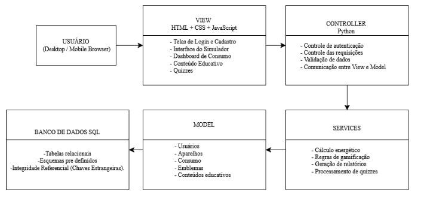
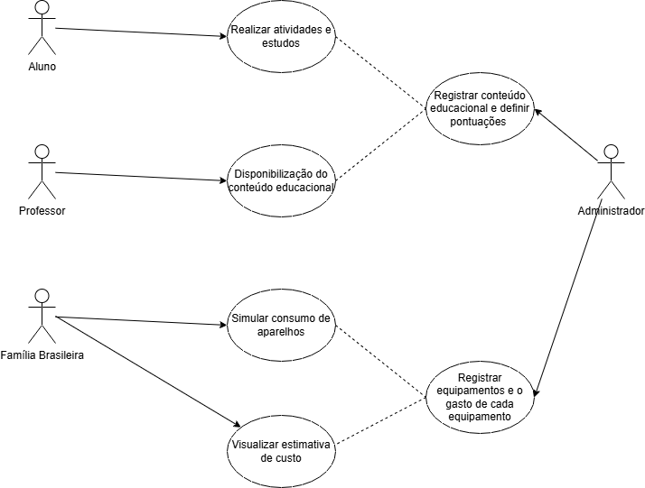
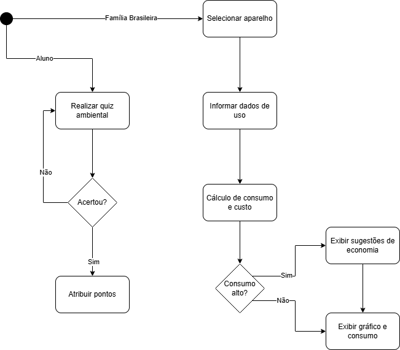
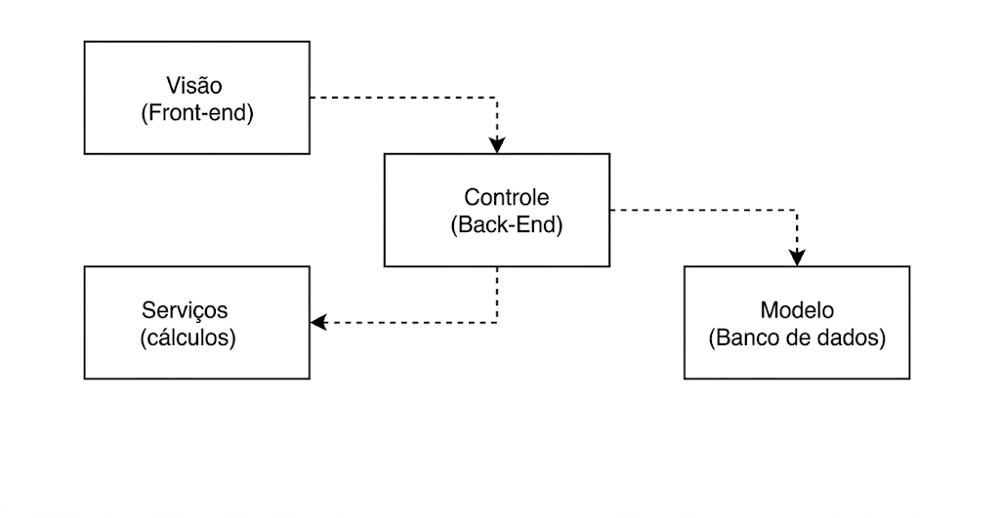
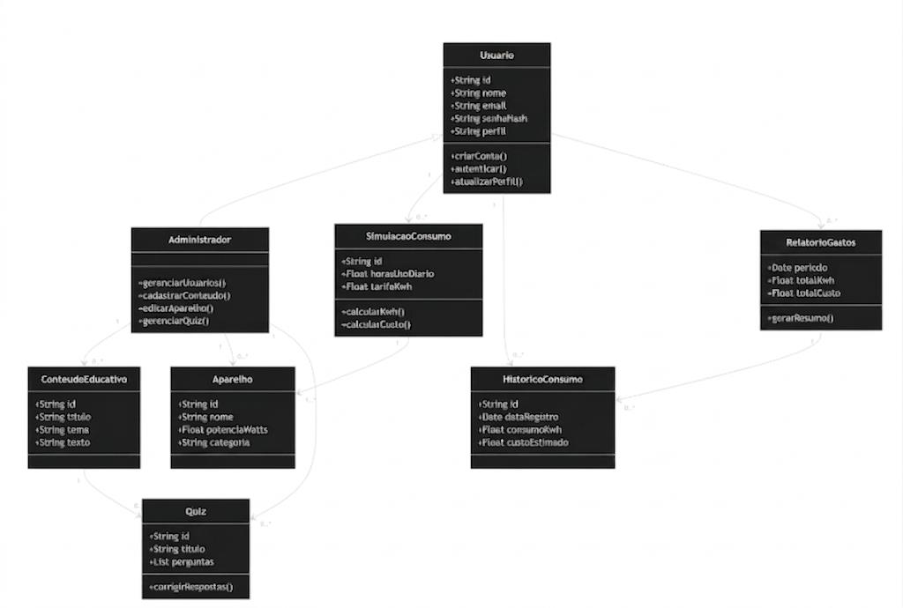
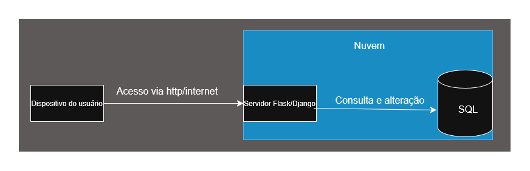

# DOCUMENTO DE ARQUITETURA 

**Versão 1.1** 

## **Tabela Integrantes do Grupo:** 

 

| Mat | Nome | Função (responsabilidade) | Pontos de participação na elaboração | 
| :--- | :--- | :--- | :--- | 
| 242023210 | Alicia Doralice de Medeiros Maia | Dona do Produto - PO | 10 | 
| 242023229 | Angeline Izaura de Lima Melo | Analista de Qualidade | 9.8 | 
| 242015138 | Bruno Ferreira Dornelas | Desenvolvedor | 8.8 | 
| 242015773 | Caio Breno De Souza Bezerra | Desenvolvedor | 8.8 | 
| 261013753 | Danielly Reis dos Santos | Desenvolvedora | 8.8 | 
| 232002655 | Gabriel Martins de Jesus da Silva | Desenvolvedor | 8.8 | 
| 231034707 | Giovana Ferreira dos Santos | Desenvolvedora | 8.8 | 
| 232003714 | Jônatas Davi Oliveira Farias | Desenvolvedor | 8.8 | 
| 242023990 | Jorge Henrique Torres Gargalhone | Desenvolvedor | 8.8 | 
| 251023602 | Kalebe Davi Sarmento da Silva | Desenvolvedor | 8.8 | 
| 242032460 | Leonardo Lopes Cruz | Desenvolvedor | 8.8 | 

 
--- 

 

## Histórico de Revisões 

| Data | Versão | Descrição | Autor(es) | 
| :--- | :----- | :-------- | :-------- | 
| 08/05/2026 | 1.0 | Primeira versão do documento, seguindo alterações no documento de visão | Alicia | 
| 23/05/2026 | 1.1 | Modificações quanto as tecnologias utilizadas no frontend | Leonardo | 
 

--- 

 

## 1 Introdução 
### 1.1 Propósito 

Este documento descreve a organização arquitetural do sistema EducaEnergia, desenvolvido na disciplina de MDS — Métodos de Desenvolvimento de Software — edição do primeiro semestre de 2026. O objetivo é fornecer uma visão abrangente e estruturada da solução para desenvolvedores, testadores e demais stakeholders, detalhando as escolhas tecnológicas e os padrões de projeto adotados para garantir a escalabilidade e a eficiência da plataforma. 

O foco deste documento está na integração dos três pilares fundamentais do produto — Simulação e Controle, Educação Ambiental — utilizando o padrão arquitetural MVC (Model-View-Controller) e tecnologias como Python, JavaScript e Python. 

### 1.2 Escopo 
O escopo do produto compreende o desenvolvimento de uma plataforma web responsiva denominada EducaEnergia, acessível gratuitamente pela Internet mediante cadastro e autenticação do usuário, destinada a consumidores residenciais, estudantes e educadores brasileiros. 

A plataforma é organizada em dois módulos funcionais: (i) Simulação e Controle de Consumo, responsável por permitir ao usuário o cadastramento de equipamentos elétricos de sua residência, o registro do tempo de utilização diária e a obtenção de estimativas de consumo mensal em quilowatts-hora (kWh) e do custo correspondente em reais, calculadas com base nas tarifas regionais vigentes estabelecidas pela Agência Nacional de Energia Elétrica (ANEEL); (ii) Educação Ambiental, responsável pela disponibilização de módulos de conteúdo sobre eficiência energética, fontes de energia renováveis e práticas de conservação, alinhados ao Objetivo de Desenvolvimento Sustentável n.º 7 (ODS 7) da Organização das Nações Unidas (ONU), com instrumentos de avaliação de aprendizagem ao término de cada módulo. 

O sistema contempla dois perfis de acesso: o perfil Usuário (P02), habilitado a realizar simulações, acessar conteúdos educativos, responder aos instrumentos de avaliação e acompanhar o registro de suas conquistas; e o perfil Administrador (P01), responsável pela gestão de usuários, pela atualização do banco de dados de equipamentos elétricos e pelo cadastramento de novos conteúdos e instrumentos de avaliação. 

--- 

 

## 2 Representação Arquitetural 
### 2.1 Definições 
O sistema seguirá uma arquitetura MVC - Model-View-Controller. A escolha do padrão MVC justifica-se porque o sistema será uma aplicação web responsiva, voltada à simulação de consumo energético e educação ambiental. Esse padrão permite separar as responsabilidades do sistema em três camadas principais: 

* **Model:** Responsável pela lógica de dados e regras de negócio, incluindo o cadastro de usuários, aparelhos elétricos, histórico de consumo, pontuações, emblemas e conteúdos educativos. 
* **View:** Responsável pela interface do usuário, desenvolvida com HTML, CSS e JavaScript, garantindo uma experiência visual, intuitiva e responsiva em computadores e dispositivos móveis. 
* **Controller:** Responsável por intermediar a comunicação entre a interface e os dados, processando as requisições do usuário, acionando a lógica do sistema e retornando as respostas adequadas. 

Essa arquitetura favorece a organização do código, a manutenção, a escalabilidade e a evolução futura da plataforma, pois permite alterações na interface e nas regras de negócio. 

 
### 2.2 Justifique sua escolha 
A arquitetura do sistema Educa Energia foi projetada para transformar os problemas de baixo letramento energético e falta de transparência no consumo em uma solução técnica viável. A estrutura escolhida integra cinco objetivos estratégicos — educação interativa, simulação precisa, interface intuitiva, auxílio socioeconômico e suporte escolar — em um sistema coeso fundamentado em dois pilares funcionais: Simulação e Educação. 

As tecnologias foram selecionadas para atender às necessidades específicas de cada pilar do escopo: 

* **Simulação e Controle (Python):** Escolhido pela alta produtividade e eficiência no processamento dos cálculos matemáticos necessários para as estimativas de kWh e custos baseados nas tarifas da ANEEL. 
* **Educação Ambiental (JS/Web Responsivo):** Conforme o Documento de Visão v. 1.0 (2026), a arquitetura garante a acessibilidade (item 1.3) para estudantes e famílias em qualquer dispositivo para estudantes e famílias em qualquer dispositivo, permitindo uma interface fluida para conteúdos e quizzes. 

 

A infraestrutura foca na flexibilidade e na organização do trabalho da equipe: 

* **Banco MySQL:** A escolha baseia-se na viabilidade técnica, visto que a maioria dos integrantes da equipe possui experiência prévia com a linguagem SQL, o que reduz a curva de aprendizado e mitiga riscos de implementação. 

* **MVC:** Facilita a manutenção e o desenvolvimento paralelo entre as equipes de frontend e backend, essencial para o ciclo de vida iterativo do projeto. 

 

A arquitetura assegura a separação rigorosa entre os perfis estabelecidos no escopo: 

* **Controle de Permissões:** O Controller valida as ações, garantindo que apenas o Administrador (P01) gerencie o sistema e conteúdos, enquanto o Usuário (P02) usufrui de uma experiência segura e simplificada. 

* **Conformidade:** Esta estrutura garante a proteção de dados conforme a LGPD e as restrições de segurança descritas na Matriz de Rastreabilidade (EDUCAENERGIA, 2026, v. 1.0). 

 

### 2.3 Detalhamento 

O sistema EducaEnergia utiliza o padrão arquitetural MVC (Model-View-Controller) para separar a interface do usuário da lógica de processamento e do gerenciamento de dados. A Figura 1 apresenta a estrutura arquitetural proposta para o sistema. 

 

<h5 align="center">Figura 1 – Estrutura Arquitetural</h5> 

<em>Fonte: EducaEnergia (2026)</em>

 

#### 2.3.1 Instanciação dos Elementos Arquiteturais 

Abaixo estão descritas as responsabilidades de cada camada, instanciadas com as tecnologias e módulos específicos do EducaEnergia: 

 

**Camada de Visão (View)** 

* **Papel:** É a interface de interação direta com o usuário (famílias, estudantes e administradores). 

* **Componentes:** Telas de simulação de consumo, dashboards de progresso, módulos de conteúdo educativo e formulários de cadastro. 

* **Tecnologias:** HTML, CSS e JavaScript, React, Vite e TailwindCSS. 

* **Responsabilidades:** Capturar as entradas do usuário (como potência de aparelhos e tempo de uso) e exibir os resultados processados (estimativas em R$ e kWh, insígnias conquistadas). 

 

**Camada de Controle (Controller)** 

* **Papel:** Atua como o intermediário que coordena o fluxo da aplicação. 

* **Componentes:** Rotas da API e controladores de lógica de autenticação e simulação. 

* **Tecnologias:** Python (Framework Flask ou Django). 

* **Responsabilidades:** Validar as permissões de acesso (Usuário vs. Administrador), receber requisições da View via REST, acionar os Services para cálculos e solicitar persistência ao Model. 

 

**Camada de Modelo (Model)** 

* **Papel:** Gerencia a estrutura, a integridade e a persistência dos dados. 

* **Componentes:** Esquemas de dados para Usuários, Aparelhos Elétricos, Logs de Consumo e Emblemas. 

* **Tecnologias:** Python (com uso de ORM para mapeamento das tabelas SQL). 

* **Responsabilidades:** Gerenciar a estrutura das tabelas de Usuários, Aparelhos e Consumo, garantindo a integridade dos dados através de relacionamentos. 

 

**Camada de Serviços (Services)** 

* **Papel:** Isolar a lógica de negócio complexa e cálculos matemáticos. 

* **Responsabilidades:** Executar o Motor de Cálculo Energético (conversão de Watts para kWh baseado nas tarifas da ANEEL). 

 

#### 2.3.2 Regras de Uso e Conectores 

1. **Interface View-Controller:** A comunicação ocorre via protocolo HTTP/HTTPS utilizando uma API REST. A View envia dados (JSON) e o Controller responde com o status da operação ou dados solicitados. 

2. **Interface Controller-Model:** O Controller utiliza drivers específicos do SQL em Python para realizar consultas. 

3. **Segurança:** Todas as requisições que envolvem dados sensíveis ou alterações no banco (como cadastrar novos conteúdos) devem passar pela validação de perfil no Controller, garantindo conformidade com a LGPD. 

 

#### 2.3.3 Justificativa das Responsabilidades 

A divisão arquitetural foi adotada para garantir: 

* Separação de responsabilidades; 

* Facilidade de manutenção; 

* Escalabilidade futura; 

* Desenvolvimento paralelo entre frontend e backend; 

* Reutilização de lógica de negócio; 

* Maior organização do código. 

 

O padrão MVC foi considerado adequado porque o EducaEnergia possui múltiplos módulos independentes que exigem organização clara entre interface, processamento e persistência de dados. 

 

### 2.4 Metas e restrições arquiteturais 

 

#### 2.4.1 Metas de Desempenho e Funcionamento: 

* **Tempo de Resposta:** Embora o texto não cite explicitamente os "2 segundos", ele justifica essa meta ao descrever a escolha do Python pela sua "alta produtividade e eficiência no processamento de cálculos matemáticos" e ao mencionar que o SQL oferece a "flexibilidade necessária para armazenar dados... de forma eficiente". 

* **Disponibilidade e Acessibilidade:** O sistema deve ser uma "plataforma web responsiva" e "acessível gratuitamente pela Internet". A arquitetura deve garantir "acessibilidade para estudantes e famílias em qualquer dispositivo". 

 

#### 2.4.2 Restrições de Padronização e Interface 

* **Padrão de API:** O documento estabelece como restrição obrigatória que a comunicação ocorra via "protocolo HTTP/HTTPS utilizando uma API REST". Isso é justificado pela necessidade de "separação de responsabilidades" e para permitir o "desenvolvimento paralelo entre frontend e backend". 

* **Padrão de Codificação:** O texto indica o uso de Python para o backend e JavaScript para o frontend. Para que o tópico 2.4 fique completo, você deve especificar se seguirão padrões como PEP 8 (Python) e Airbnb (JS), o que é condizente com a organização em camadas (MVC) descrita para "maior organização do código". 

 

#### 2.4.3 Restrições de Segurança e Conformidade 

* **Segurança de Dados (LGPD):** O sistema possui a restrição de garantir a "proteção de dados conforme a LGPD". Isso é justificado pelo Controller, que deve "validar as ações, garantindo que apenas o Administrador (P01) gerencie o sistema". 

* **Regras de Negócio:** Os cálculos devem seguir obrigatoriamente as "tarifas regionais vigentes estabelecidas pela Agência Nacional de Energia Elétrica (ANEEL)". 

 

#### 2.4.4 Restrições de Infraestrututra 

* **Modelo de Implantação:** O software deve seguir o "modelo cliente-servidor" e ser hospedado em "serviços de nuvem (AWS, Azure ou similar)". 

* **Persistência:** O uso do SQL é uma restrição tecnológica justificada pela necessidade de lidar com "dados heterogêneos" e "logs de progresso" de forma flexível. 

 

### 2.5 Visões 

 

**Visão de uso:** 

O EducaEnergia é uma plataforma web responsiva voltada a: 

* Usuários residenciais que desejam entender e reduzir o consumo de energia. 

* Estudantes e professores que utilizam o sistema como ferramenta educativa. 

 

Principais funcionalidades: 

* **Simulação e controle:** cadastro de aparelhos, cálculo e visualização do consumo energético, estimativas de custo e sugestões de economia. 

* **Educação ambiental:** conteúdos interativos (textos, quizzes, dicas práticas). 

* **Acesso simples:** interface intuitiva, sem necessidade de conhecimento técnico. 

Exemplo: um usuário cadastra sua geladeira e chuveiro, e o sistema mostra quanto cada um consome por mês e sugere mudanças para reduzir custos. 

 

**Visão organizacional lógica:** 

O Sistema é organizado no formato MVC. 

* **Camada de apresentação (View):** 

  * Tecnologias: HTML, CSS, JavaScript, React, Vite e TailwindCSS. 

  * Responsável pela interface com o usuário, renderização das páginas e interação (forms, gráficos, dashboards). 

* **Camada de aplicação (Controller):** 

  * Tecnologias: Python (framework web como Flask ou Django). 

  * Recebe requisições, processa regras de negócio, valida dados e coordena o fluxo entre View e Model. 

* **Camada de domínio/dados (Model):** 

  * Representa entidades como Usuário, Consumo, Desafios. 

  * Implementa regras de negócio (ex: cálculo de consumo energético). 

  * Integra com o banco de dados SQL. 

 

**Visão estrutural:** 

Componentes principais: 

* **Frontend:** 

  * Interface web (HTML/CSS/JS/React/Vite/TailwindCSS). 

  * Comunicação com backend via HTTP/REST (fetch/AJAX). 

* **Backend (Python):** 

  * Controllers: gerenciam rotas (login, cadastro, simulação, conteúdo educativo). 

  * Services: lógica de cálculo de consumo, recomendações. 

  * Models: estruturas de dados e persistência. 

* **Banco de dados (SQL):** 

  * Armazena usuários, aparelhos, histórico de consumo. 

 

Relações: 

* O usuário interage com a View. 

* A View envia requisições ao Controller. 

* O Controller chama os Models/Services. 

* Os Models acessam o SQL. 

* A resposta retorna ao usuário via View. 

 

Exemplo de fluxo: 

* Usuário cadastra um aparelho → Controller recebe → Model salva no SQL → Service calcula consumo → resultado exibido na interface. 

 

Ambiente típico: 

* **Cliente:** 

  * Navegador web (desktop ou mobile). 

  * Executa HTML, CSS, JavaScript e renderiza o React. 

* **Servidor de aplicação:** 

  * Backend em Python (Flask/Django). 

  * Pode rodar em servidor Linux (ex: Ubuntu). 

  * Hospedagem em nuvem (AWS, Azure, ou similar). 

* **Servidor de banco de dados:** 

  * SQL (local ou em serviço gerenciado como SQL Atlas). 

 

Comunicação: 

* Protocolo HTTP/HTTPS. 

* API REST entre frontend e backend. 

 

#### 2.5.1 Visão uso 

O EducaEnergia é uma plataforma web responsiva de conscientização energética que permite a usuários residenciais e acadêmicos gerenciar o consumo de dispositivos elétricos. O sistema integra ferramentas de simulação de gastos e conteúdo educativo interativo, visando transformar dados técnicos de consumo em informações acessíveis e incentivos práticos para a sustentabilidade. 

 

<h3 align="center">Figura 2 - Diagrama de Uso</h3> 

<em>Fonte: EducaEnergia (2026)</em>

 

<h3 align="center">Figura 3 - Diagrama de atividades</h3> 

<em>Fonte: EducaEnergia (2026)</em>

 

#### 2.5.1.3 Estilo arquitetural 

 

#### 2.5.2 Visão de organização lógica 

O sistema Educa Energia é subdividido em módulos lógicos que seguem o padrão de arquitetura Model-View-Controller (MVC). Essa organização permite que a interface do usuário, a lógica de processamento e o acesso aos dados sejam independentes, facilitando a manutenção e a escalabilidade do projeto. 

 

**2.5.2.1 Módulos do Sistema** 

Os principais pacotes que compõem a lógica do sistema são: 

* **Pacote de Visão (View):** Compreende a interface front-end desenvolvida em HTML, CSS, JavaScript, React, Vite e TailwindCSS. É responsável por exibir as telas de simulação de consumo e os módulos educativos. Garante que a experiência do usuário seja responsiva e intuitiva, permitindo o uso em desktops e celulares. 

* **Pacote de Controle (Controller):** Implementado em Python, este módulo atua como o cérebro da aplicação. Ele recebe as entradas do usuário vindas da View (como a potência dos aparelhos e tempo de uso) e aciona as funções de cálculo ou busca de dados. Centraliza as regras de negócio do sistema. Ao separar essa lógica da interface, conseguimos testar as funções de cálculo em Python sem precisar carregar o navegador. 

* **Pacote de Modelo (Model/Persistência):** Responsável pela interface com o banco de dados SQL. Ele define como os dados de usuários, aparelhos cadastrados e conquistas (emblemas) são estruturados e manipulados. Utiliza a flexibilidade do SQL para armazenar perfis de usuários e logs de consumo de forma eficiente. 

* **Pacote de Serviços (Services):** (Opcional, mas recomendado para o back-end) Contém a lógica específica de cálculos energéticos (conversão de Watts/Tempo em kWh e R$) e Isola os cálculos matemáticos complexos de energia limpa, garantindo que o simulador seja preciso e fácil de atualizar caso as tarifas da ANEEL mudem. 

 

**2.5.2.2 Comunicação e Interface** 

1. O Front-end (View) envia dados para o Back-end (Controller) através de requisições HTTP (API REST). 

2. O Controller processa a informação e, se necessário, solicita ao Model que salve ou busque dados no SQL. 

3. O Model retorna os dados brutos, o Controller aplica a lógica necessária e devolve uma resposta (geralmente em formato JSON) para a View atualizar a tela do usuário. 

 

<h3 align="center">Figura 4 - Diagrama de pacotes</h3> 

<em>Fonte: EducaEnergia (2026)</em>

 

#### 2.5.3 Visão estrutural 

A visão estrutural do EducaEnergia apresenta os principais componentes internos do sistema, suas responsabilidades e a forma como se relacionam. A estrutura segue o padrão arquitetural MVC, complementado por uma camada de Services, responsável por concentrar regras de negócio específicas, como cálculo energético, relatórios e validação de quizzes. Essa organização permite separar a interface do usuário, o controle das requisições, a lógica de negócio e a persistência dos dados, facilitando a manutenção, os testes e a evolução incremental da plataforma. 

 

**2.5.3.1 Elementos estruturais do sistema** 

O sistema é composto pelos seguintes elementos principais: 

* A View/Frontend corresponde à interface da aplicação, responsável por exibir as telas de login, cadastro, simulação de consumo, conteúdos educativos, quizzes, relatórios, progresso, emblemas e painel administrativo. Também captura as informações inseridas pelo usuário e apresenta os resultados processados pelo sistema. 

* Os Controllers recebem as requisições da interface, validam os dados enviados, verificam permissões de acesso e encaminham cada solicitação para o serviço adequado. Assim, organizam o fluxo da aplicação sem concentrar diretamente as regras de negócio. 

* A camada de Services reúne as regras principais do sistema, como cálculo de consumo energético, estimativa de custo, geração de relatórios, validação de quizzes, controle de pontuação e concessão de emblemas. 

* Os Models representam as entidades do domínio, como usuário, administrador, aparelho, simulação, histórico, conteúdo educativo, quiz, emblema e relatório, além de intermediar o acesso aos dados persistidos. 

* Por fim, o SQL armazena as informações da plataforma, incluindo usuários, aparelhos, históricos de consumo, simulações, conteúdos, quizzes, pontuações, emblemas e relatórios. 

 

A comunicação entre a interface e o backend ocorre por meio de requisições HTTP/HTTPS, utilizando respostas em formato JSON. A View não acessa diretamente o banco de dados; todas as operações passam pelo backend, garantindo maior controle, segurança e organização. 

 

**2.5.3.2 Fluxo geral de funcionamento** 

De forma geral, o funcionamento estrutural do sistema ocorre da seguinte maneira: 

1. O usuário acessa a plataforma pelo navegador. 

2. A View envia uma requisição ao Controller correspondente. 

3. O Controller valida os dados e permissões. 

4. O Controller aciona o Service responsável. 

5. O Service processa a regra de negócio. 

6. Os Models acessam ou atualizam os dados no SQL. 

7. O resultado retorna para a View e é exibido ao usuário. 

 

<h3 align="center">Figura 5 - Diagrama de componentes</h3> 

<em>Fonte: EducaEnergia (2026)</em>

 

O diagrama de componentes mostra a separação entre frontend, backend, serviços, modelos e banco de dados. Essa divisão evita dependências diretas entre a interface e a persistência, permitindo que as regras de negócio sejam centralizadas no backend. 

 

<h3 align="center">Figura 6 - Diagrama de classes</h3> 

<em>Fonte: EducaEnergia (2026)</em>

 

O diagrama de classes representa as principais entidades do domínio. A classe Usuario concentra os dados básicos de autenticação e perfil. A classe Administrador herda de Usuario e possui permissões adicionais para gerenciar usuários, aparelhos, conteúdos e quizzes. A classe Aparelho representa os equipamentos utilizados na simulação. A classe SimulacaoConsumo utiliza os dados do aparelho, tempo de uso e tarifa para calcular consumo em kWh e custo estimado. Os resultados são armazenados em HistoricoConsumo e podem ser consolidados em RelatorioGastos. O módulo educativo é representado por ConteudoEducativo e Quiz. 

 

### 2.6 Visão de Implantação 

O software EducaEnergia será implementado conforme o modelo cliente-servidor. 

 

#### 2.6.1 Infraestrutura de Hardware 

A plataforma Educa Energia será hospedada em um serviço de hospedagem virtual como Amazon Web Services, Vercel, Azure ou similares. Esta escolhe é justificada pela possibilidade de escalabilidade, suporte a multiplos acessos simultaneos e que não depende de uma máquina pessoal para manter o sistema em andamento. 

 

#### 2.6.2 Tecnologias de Implantação 

O sistema contará com o flask ou django para realizar requisições ao banco de dados. O uso destes frameworks se dá por ser voltado para a produtividade e possuir baixa curva de aprendizagem. 

 

#### 2.6.3 Banco de Dados 

A persistência dos dados será feita através do PostgreeSQL. O uso de uma estrutura SQL justifica-se pela natureza dos dados que possuem relações claras e precisam ser rigorosamente consistentes. Lidar com históricos de cálculos e dados dos usuários. O SQL também possibilita execução de consultas complexas. 

 

#### 2.6.4 Diagrama de implantação 

<h3 align="center">Figura 7 - Diagrama de implantação</h3> 

<em>Fonte: EducaEnergia (2026)</em>

 

### 2.7 Restrições adicionais 

#### 2.7.1 Acessibilidade Web 
A aplicação web EducaEnergia será acessada por navegadores como Google Chrome, Firefox e Microsoft Edge, que também funcionará nos dispositivos mobile, tanto Android como IOS sem qualquer perda de informação, ou quebra de layout por exemplo. 

#### 2.7.2 Segurança e acesso 
Será necessário realizar autenticação por meio de login e senha para acesso aos perfis da aplicação, garantindo a proteção dos dados dos usuários conforme os princípios da LGPD. Além disso, o Controller será responsável por validar ações que envolvam dados sensíveis ou funcionalidades restritas, verificando as permissões de acesso de cada perfil de usuário. 

#### 2.7.3 Perfis de acesso 

* **Administrador:** Possuirá permissões avançadas para gerenciamento da plataforma, incluindo manutenção de usuários (criação e exclusão de contas), edição dos valores de potência dos aparelhos armazenados no banco de dados e cadastro de novos conteúdos educativos, como textos e quizzes. 
* **Usuário:** Terá acesso às funcionalidades relacionadas ao uso da plataforma, incluindo acesso e modificação do próprio perfil, realização de simulações de consumo energético, definição do tempo de uso dos aparelhos, cadastro do consumo em kWh por equipamento, visualização de metas e conquistas (emblemas/insígnias), além do acesso aos conteúdos educativos e participação em quizzes interativos. 

--- 

## 3 Bibliografia 

* AGÊNCIA NACIONAL DE ENERGIA ELÉTRICA (ANEEL). Informações sobre Tarifas. Brasília, DF: ANEEL, 2026. Disponível em: https://www.gov.br/aneel/pt-br/assuntos/tarifas. Acesso em: 28 abr. 2026. 

* Diretriz: Visão Arquitetural. Disponível em: <https://www.trt9.jus.br/pds/pdstrt9/guidances/guidelines/architectural_view_FF6EDA37.html>. Acesso em: 6 maio. 2026. 

* NAÇÕES UNIDAS BRASIL. Objetivo 7: Energia Limpa e Acessível. Brasília, DF: ONU, 2023. Disponível em: https://brasil.un.org/pt-br/sdgs/7. Acesso em: 24 abr. 2026. 

* EDUCAENERGIA. Documento de Visão do Produto e do Projeto: EducaEnergia. Versão 1.0. Brasília, DF: UnB, 2026. 1 arquivo PDF. Trabalho apresentado à disciplina de Métodos de Desenvolvimento de Software. 