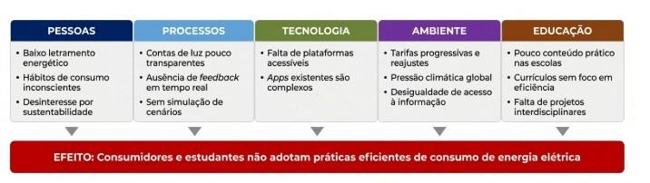
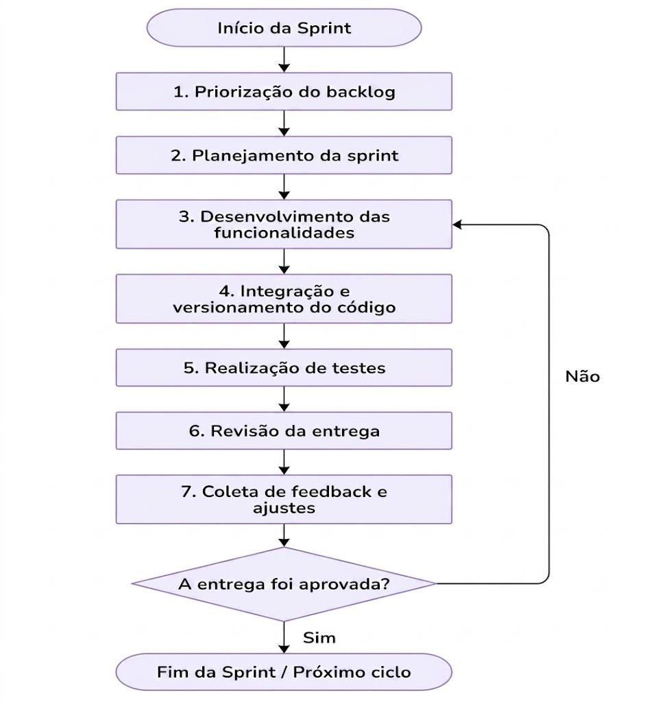
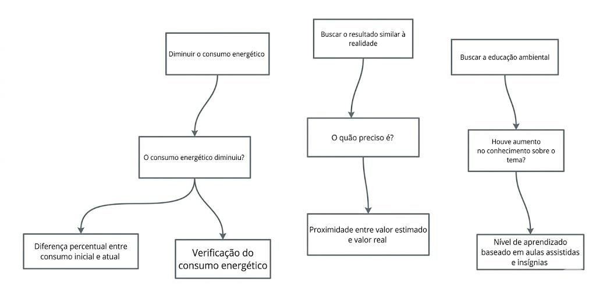

# VISÃO DO PRODUTO E DO PROJETO 

**Versão 1.3** 

 

## **Tabela - Integrantes do Grupo:** 
| Matrícula | Nome | Função (responsabilidade) | Pontos de participação na elaboração | 
| :--- | :--- | :--- | :--- | 
| 242023210 | Alicia Doralice de Medeiros Maia | Dona do Produto - PO | 8.4 | 
| 242023229 | Angeline Izaura de Lima Melo | Analista de Qualidade | 8.4 | 
| 242015138 | Bruno Ferreira Dornelas | Desenvolvedor Backend | 8.4 | 
| 242015773 | Caio Breno De Souza Bezerra | Analista de Qualidade | 8.4 | 
| 261013753 | Danielly Reis dos Santos | Desenvolvedora Backend | 8.4 | 
| 232002655 | Gabriel Martins de Jesus da Silva | Desenvolvedor Backend | 8.4 | 
| 231034707 | Giovana Ferreira dos Santos | Desenvolvedora Frontend | 8.4 | 
| 232003714 | Jônatas Davi Oliveira Farias | Desenvolvedor Backend | 8.4 | 
| 242023990 | Jorge Henrique Torres Gargalhone | Desenvolvedor Backend | 8.4 | 
| 251023602 | Kalebe Davi Sarmento da Silva | Desenvolvedor Backend | 8.4 | 
| 242032460 | Leonardo Lopes Cruz | Desenvolvedor Frontend | 8.4 | 

--- 

## Histórico de Revisões 
| Data | Versão | Descrição | Autor | 
| :--- | :--- | :--- | :--- | 
| 01/05/2026 | 1.0 | Versão inicial do documento, incluindo objetivos, escopo e requisitos principais | Alicia | 
| 23/05/2026 | 1.1 | Alterações quanto as tecnologias usadas no desenvolvimento do frontend | Leonardo | 
| 23/05/2026 | 1.1 | Alterações no backlog | Danielly | 
| 23/05/2026 | 1.1 | Alteração de tudo relacionado a gamificação do documento. | Jônatas | 
| 23/05/2026 | 1.1 | Alteração do tipo de banco de dados e do responsável pelos desenvolvedores. | Jorge | 
| 30/05/2026 | 1.2 | Adiciona o Caio no FrontEnd | Leonardo | 
| 06/06/2026 | 1.3 | Reorganização do documento de visão | Danielly | 

--- 

## 1 VISÃO GERAL DO PRODUTO 
### 1.1 Problema 
#### 1.1.1 Contexto 
O setor elétrico brasileiro é marcado por tarifas progressivas e reajustes frequentes, que impactam diretamente o orçamento familiar. Segundo a Agência Nacional de Energia Elétrica (ANEEL), o consumo residencial representa parcela significativa da matriz de demanda do país, sendo também um dos segmentos com menor grau de conscientização sobre eficiência energética. 

Em paralelo, a agenda climática global impõe pressão- crescente sobre governos, empresas e cidadãos para a redução das emissões de gases de efeito estufa e a adoção de fontes renováveis. Nesse cenário, as famílias brasileiras enfrentam um duplo desafio: reduzir o impacto financeiro da conta de energia elétrica e, ao mesmo tempo, contribuir para a sustentabilidade ambiental. Contudo, a maioria dos consumidores desconhece quais equipamentos domésticos mais contribuem para o consumo elevado, não tem acesso a ferramentas simples de simulação e raramente recebe educação formal sobre eficiência energética e fontes renováveis. 

O contexto escolar agrava essa situação: educadores que desejam abordar temas de educação ambiental e consumo sustentável carecem de plataformas interativas e acessíveis para engajar alunos de forma prática e lúdica. Assim, o problema não é apenas técnico ou financeiro é também cultural e educacional. 

#### 1.1.2 Problema Identificado 
O problema central pode ser enunciado da seguinte forma: 

A falta de transparência e acessibilidade nas informações sobre consumo de energia elétrica, aliada à ausência de ferramentas educativas e engajadoras, impede que os consumidores residenciais e estudantes adotem comportamentos mais eficientes e sustentáveis. 

Para melhor compreensão das causas e efeitos desse problema, apresenta-se a seguir o Diagrama de Ishikawa na Figura 1, também conhecido como Diagrama de Causa e Efeito ou Espinha de Peixe. Essa ferramenta permite visualizar de forma estruturada as múltiplas causas que contribuem para o problema central. 

<h5 align="center"> Figura 1 - Diagrama de Ishikawa do Problema Central do EducaEnergia </h5>

<em>Fonte: EducaEnergia (2026)</em>

A análise do Diagrama de Ishikawa conforme a Figura 1 revela que o problema possui causas distribuídas em cinco dimensões inter-relacionadas. No eixo Pessoas, destaca-se o baixo letramento energético e os hábitos de consumo inconscientes, que perpetuam o desperdicio mesmo entre consumidores com maior renda. No eixo Processos, a opacidade das contas de energia e a ausência de ferramentas de feedback em tempo real impedem que o consumidor compreenda exatamente onde ocorrem os maiores gastos. 

No eixo Tecnologia, a carência de plataformas acessíveis e intuitivas que combinem simulação, educação e engajamento representa uma lacuna de mercado. Os aplicativos existentes tendem a ser técnicos demais para o público geral ou carecem de funcionalidades educativas. No eixo Ambiente, o contexto de tarifas progressivas e pressão climática global cria urgência para soluções que democratizem o acesso à informação energética. Por fim, no eixo Educação, a ausência de ferramentas pedagógicas práticas impede que escolas abordem o tema de forma eficaz e engajante. 

O efeito resultante dessas causas é a persistência de padrões de consumo ineficientes, tanto no ambiente doméstico quanto no escolar, perpetuando o desperdício energético e o desalinhamento com os objetivos de desenvolvimento sustentável. 

#### 1.1.3 Solução de Software Proposta 
A análise das causas identificadas conduz à proposta do EducaEnergia: uma plataforma web responsiva que integra dois pilares funcionais Simulação e Controle e Educação Ambiental em uma experiência única, acessível e engajadora. 

A solução atua diretamente nas causas mapeadas: (i) combate o baixo letramento energético por meio de conteúdo educativo interativo; (ii) supre a ausência de transparência ao permitir o mapeamento detalhado dos aparelhos e a simulação do consumo residencial; (iii) preenche a lacuna tecnológica com uma interface intuitiva, projetada para usuários sem conhecimento técnico; (iv) responde ao contexto socioeconômico ao oferecer gratuitamente ferramentas que auxiliam famílias a reduzirem sua conta de luz; e (v) apoia o ambiente escolar com recursos pedagógicos que tornam o tema de sustentabilidade concreto e motivador. 

Espera-se que a plataforma empodere o consumidor residencial com informações claras e acionáveis, reduza o desperdício energético por meio da mudança de hábitos, e contribua para a formação de uma geração mais consciente sobre sustentabilidade. 

### 1.2 Declaração de Posição do Produto 
A declaração de posição do produto, conforme apresentada no Quadro 1, sintetiza de forma estruturada a proposta de valor, o público-alvo e o diferencial competitivo do EducaEnergia. Este instrumento é amplamente utilizado na engenharia de requisitos para comunicar, de modo conciso, a essência do produto a todos os stakeholders. 

**Tabela 1 - Declaração de Posição do Produto** 

| Para: | Famílias brasileiras preocupadas com o valor da conta de luz; estudantes e educadores que buscam conteúdo prático sobre sustentabilidade e eficiência energética. | 
| :--- | :--- | 
| **Necessidade:** | Compreender e controlar o consumo de energia elétrica de forma simples, visual e educativa, promovendo a redução de gastos e a conscientização ambiental. | 
| **O Produto (EducaEnergia):** | É uma aplicação WEB que integra simulação de consumo e educação ambiental em uma única plataforma responsiva e de acesso gratuito. | 
| **Que:** | Permite ao usuário mapear os equipamentos domésticos, simular o consumo e o custo da conta de energia, aprender sobre eficiência energética e fontes renováveis, e engajar-se em quizzes que incentivam a mudança real de hábitos. | 
| **Ao contrário:** | Das calculadoras de consumo isoladas (e.g., calculadora da ANEEL) e dos aplicativos de monitoramento proprietários das distribuidoras, que são fragmentados, não educativos e sem recursos de engajamento. Na ausência do EducaEnergia, o consumidor permanece sem uma visão integrada do seu consumo e sem motivação para mudar seus hábitos. | 
| **Nosso produto:** | Diferencia-se por combinar, em uma mesma plataforma gratuita, a precisão da simulação energética, a profundidade do conteúdo educativo e o engajamento dos quizzes tornando o consumo consciente acessível para famílias e utilizável como recurso didático em contextos escolares. | 

 

### 1.3 Objetivos do Produto 

O objetivo principal do Educa Energia é desenvolver uma plataforma web responsiva que empodere consumidores residenciais e estudantes com ferramentas integradas de simulação de consumo energético e educação ambiental, promovendo a redução da conta de luz e a adoção de hábitos sustentáveis. Este objetivo central desdobra-se nos seguintes objetivos secundários, que orientam o desenvolvimento de cada módulo funcional da plataforma: 

* **Objetivo 1 - Simulação e Controle:** Permitir que o usuário cadastre os aparelhos elétricos de sua residência, informe o tempo de uso diário e obtenha uma previsão precisa do consumo mensal em kWh e do custo estimado da fatura, considerando as tarifas vigentes por região. O usuário deve ser capaz de identificar os "vilões" do consumo e simular cenários alternativos de uso. 

* **Objetivo 2 - Educação Ambiental:** Disponibilizar um módulo educativo com conteúdos sobre eficiência energética, fontes de energia renováveis, impactos ambientais do desperdício e medidas práticas de conservação, apresentados em linguagem acessível e com recursos visuais interativos. O módulo deve ser utilizável como material de apoio em contextos escolares. 

* **Objetivo 3 - Engajamento:** Implementar um sistema de desafios práticos com metas de redução de consumo, acúmulo de pontos, conquistas (badges) e ranking entre usuários. Os desafios devem ser contextualizados com horários de pico tarifário e boas práticas de uso eficiente, incentivando a mudança comportamental de forma lúdica e contínua. 

* **Objetivo 4 - Acessibilidade e Usabilidade:** Garantir que a plataforma seja responsiva (compatível com dispositivos móveis e desktops), de navegação intuitiva para usuários sem conhecimento técnico e de acesso gratuito, democratizando o acesso à informação energética. 

* **Objetivo 5 - Impacto Mensurável:** Permitir que o usuário acompanhe sua evolução ao longo do tempo, comparando o consumo histórico com as metas estabelecidas e visualizando o impacto financeiro e ambiental de suas escolhas. 

Todos os objetivos estão alinhados à proposta de valor central do produto e às necessidades dos usuários identificadas na análise do problema. O desenvolvimento será iterativo, priorizando os objetivos 1 e 3 nas primeiras versões e expandindo progressivamente os demais módulos. 

### 1.4 Tecnologias a Serem Utilizadas 

A definição do Stack tecnológico do EducaEnergia foi pautada por critérios estratégicos que visam garantir a escalabilidade, a manutenibilidade e a eficiência do desenvolvimento. Os principais pilares para a seleção das ferramentas foram: 

1. **Compatibilidade e Responsividade:** Adoção de tecnologias que assegurem uma experiência de usuário consistente tanto em dispositivos móveis quanto em desktops; 

2. **Viabilidade Técnica:** Escolha de linguagens com curva de aprendizado compatível com o perfil da equipe, permitindo uma entrega ágil das funcionalidades; 

3. **Ecossistema de Bibliotecas:** Priorização de ferramentas que ofereçam frameworks robustos para acelerar a implementação de módulos complexos, como a visualização dinâmica de dados energéticos; 

4. **Padronização e Engenharia:** Alinhamento com as práticas modernas de engenharia de software, utilizando padrões de projeto e ferramentas de conteinerização. 

A Tabela 2 consolida as tecnologias previstas para as diferentes camadas da solução. Ressalta-se que o detalhamento técnico da arquitetura, bem como o fluxo de interação entre esses componentes, será aprofundado no Documento de Arquitetura de Software em etapas subsequentes do cronograma. 

**Tabela 2 - Stack Tecnológico do Projeto Educa Energia** 

| Camada | Tecnologia/Ferramenta | Descrição e Justificativa | 
| :--- | :--- | :--- | 
| Frontend | HTML, CSS, JavaScript, React, Vite e TailWindCSS | Tecnologias fundamentais para a criação de uma interface web responsiva, garantindo que o EducaEnergia funcione em desktops e dispositivos móveis. | 
| Backend | Python | Linguagem robusta e versátil, ideal para implementar a lógica de simulação energética com alta produtividade. | 
| Persistência (Banco de dados) | PostgreSQL | Banco de dados baseado em SQL, linguagem utilizada para acessar, manipular e gerenciar dados. Foi adotado no projeto devido à familiaridade e facilidade de utilização pelos integrantes da equipe. | 
| Infraestrutura/DevOps | Docker | Utilizado para a conteinerização da aplicação, garantindo que o ambiente de desenvolvimento seja idêntico ao de produção e facilitando o deploy. | 
| Ambiente de desenvolvimento (IDE) | VS Code/Visual Studio | Ferramentas de desenvolvimento integradas que oferecem suporte nativo para as linguagens escolhidas e agilizam a depuração de código. | 
| Padrão Arquitetural | MVC (Model-View-Controller) | Técnica de organização de software que separa a lógica de dados, a interface e o controle, facilitando a manutenção e a escalabilidade do sistema. | 

 
--- 

 

## 2 VISÃO GERAL DO PROJETO 
### 2.1 Ciclo de vida do projeto de desenvolvimento de software 

Para o desenvolvimento da plataforma, será adotado um ciclo de vida iterativo e incremental, apoiado em uma abordagem ágil de desenvolvimento de software. Essa escolha se justifica pela natureza do produto, que envolve funcionalidades educativas, simulação de consumo energético e acompanhamento de resultados, exigindo validações constantes com os usuários finais. 

A plataforma tem como proposta integrar três pilares principais: simulação e controle e educação ambiental, oferecendo ao usuário a possibilidade de mapear equipamentos domésticos, simular consumo e custo de energia e aprender sobre eficiência energética. Além disso, o produto tem como público-alvo famílias, estudantes e educadores, o que torna necessário um processo de desenvolvimento flexível, capaz de incorporar melhorias a partir de testes de usabilidade e feedback dos usuários. 

Dessa forma, o ciclo de vida escolhido não será linear e rígido, como no modelo cascata, mas sim organizado em entregas progressivas, permitindo que partes funcionais da plataforma sejam desenvolvidas, testadas, avaliadas e aprimoradas ao longo do projeto. 

#### 2.1.1 Metodologia 
A metodologia adotada será uma abordagem ágil, iterativa e incremental, com organização do trabalho em ciclos curtos de desenvolvimento. Cada ciclo terá como objetivo entregar uma parte funcional do sistema, possibilitando avaliação contínua da solução. 

Essa metodologia é adequada ao projeto porque o problema identificado envolve não apenas uma necessidade técnica, mas também educacional e comportamental. Como o produto busca gerar engajamento e aprendizagem, é essencial testar a interface, os conteúdos ao longo do desenvolvimento. 

#### 2.1.2 Processo 
O processo de desenvolvimento da plataforma será dividido nas seguintes etapas que é desejado serem alcançadas: 

1. **Levantamento e análise de requisitos:** identificação das necessidades dos usuários, considerando famílias, estudantes e educadores. Nessa etapa, serão definidos os requisitos funcionais, como cadastro de aparelhos, cálculo de consumo, módulo educativo e requisitos como responsividade, acessibilidade, usabilidade e gratuidade. 

2. **Prototipação da interface:** criação de telas iniciais da plataforma, priorizando uma navegação simples, visual e intuitiva. Como o público pode não possuir conhecimento técnico, a interface deverá facilitar a compreensão dos dados de consumo e tornar a experiência agradável. 

3. **Modelagem e arquitetura do sistema:** organização da estrutura da aplicação, separando as responsabilidades entre modelo, visão e controle. Essa técnica favorece a manutenção do código, a organização do projeto e a evolução futura da plataforma. 

4. **Desenvolvimento incremental dos módulos:** implementação dos módulos da plataforma por partes. 

5. **Testes e validação:** realização de testes funcionais, testes de usabilidade e testes de compatibilidade em diferentes dispositivos. Essa etapa verificará se os cálculos estão corretos, se a navegação é intuitiva e se os recursos educativos realmente favorecem o engajamento. 

 

#### 2.1.3 Procedimento, métodos e ferramentas 
Os procedimentos adotados no projeto serão organizados por ciclos de desenvolvimento, podendo ser representados por pequenas entregas ou versões da plataforma. Em cada ciclo, a equipe deverá planejar as funcionalidades, desenvolver, testar e revisar os resultados obtidos. 

 

**Tabela 3: Procedimentos, métodos e ferramentas** 

| Elemento | Aplicação | 
| :--- | :--- | 
| Metodologia | Desenvolvimento ágil, iterativo e incremental | 
| Processo | Levantamento de requisitos, prototipação, modelagem, implementação, testes, implantação e manutenção | 
| Técnicas de Desenvolvimento | Prototipação, testes de usabilidade, testes funcionais e versionamento | 
| Linguagens | Python, JavaScript, HTML e CSS | 
| Banco de Dados | PostgreSQL | 
| Ferramentas | Docker, VS Code e Visual Studio | 
| Produto Esperado | Plataforma web responsiva, educativa e gamificada | 

A escolha das tecnologias está alinhada à proposta de criação de uma aplicação web responsiva, acessível e com potencial de expansão. O uso de HTML, CSS, JavaScript, React, Vite e TailwindCSS permitirá o desenvolvimento da interface visual e interativa da plataforma. O Python poderá ser utilizado na lógica da aplicação e no processamento das informações de consumo. O SQL será utilizado para armazenamento dos dados dos usuários, aparelhos cadastrados, consumo estimado, pontuações e conquistas. O Docker auxiliará na padronização do ambiente de desenvolvimento e implantação, reduzindo problemas de compatibilidade. 

### 2.2 Organização do Projeto 
**Tabela 4: Atribuições da equipe** 

| Papel | Atribuições | Responsável | Participantes | 
| :--- | :--- | :--- | :--- | 
| Desenvolvedores | Codificar o produto, codificar testes unitários, realizar refatoração | Jorge | Danielly, Gabriel, Giovana, Leonardo, Bruno, Jônatas, Kalebe | 
| Dona do Produto | Atualizar o escopo do produto, organizar o escopo das sprints, validar as entregas | Alicia | | 
| Analista de Qualidade | Garantir a qualidade do produto, garantir o cumprimento do conceito de pronto, realizar inspeções de código | Angeline | Jonatas, Caio, Alicia | 
| Cliente | Atualizar o escopo do produto, organizar o escopo das sprints, validar as entregas | Alicia | | 

 

### 2.3 Planejamento das Fases e/ou Iterações do Projeto 
**Tabela 5: Fases do projeto** 

| Sprint | Produto (Entrega) | Data Início | Data Fim | Entregável(eis) | Responsaveis | % conclusão | 
| :--- | :--- | :--- | :--- | :--- | :--- | :--- | 
| Sprint 1 | Definição do Produto | 25/04/2026 | 25/04/2026 | | | 100% | 
| Sprint 2 | MVP e Planejamento do Projeto | 25/04/2026 | 01/05/2026 | | | 100% | 
| Sprint 3 | C01/RF01 | 23/05/2026 | 01/05/2026 | **Frontend**: Tela de login e cadastro    **Backend**: Login, cadastro e vínculo com banco de dados    **Testes de Software**: Testes de funcionamento do login, cadastro e banco de dados | **Frontend**: Leonardo, Giovana, Caio    **Backend**: Danielly, Jorge, Jonata.    **Testes de Software**: Danielly | 100% | 
| Sprint 4 | RF02 | 06/06/2026 | 08/06/2026 | **Frontend**:    **Backend**: Calculo medio de 3, 6 e 9 meses de gasto de energia.    **Testes de Software**: Verficação da consistencia dos cálculos | **Frontend**:    **Backend**: Danielly, Jônatas, Jorge, Gabriel     **Testes de Software**: Danielly, Gabriel | 90% |

 

### 2.4 Matriz de Comunicação 
**Tabela 6: Matriz de Comunicação** 

| Descrição | Area/ Envolvidos | Periodicidade | Produtos Gerados | 
| :--- | :--- | :--- | :--- | 
| Reunião de Planejamento | Equipe do Projeto (Desenvolvedores, PO e Qualidade) | Semanal | Backlog da Sprint e Metas definidas | 
| Acompanhamento das Atividades | Equipe do Projeto | Semanal | Relatório da situação do Projeto | 
| Alinhamento com Stakeholders | Equipe + Monitor | Quinzenal | Ata de Reunião de Relatório de situação | 
| Sincronização Técnica (Code Review/Qualidade) | Desenvolvedores e Analistas de Qualidade | Contínua (por Pull Request) | Código revisado, testes unitários e logs de debug | 

 

### 2.5 Gerenciamento de Riscos 
Abaixo, listamos os principais riscos identificados para o contexto da FCTE e da disciplina de MDS: 

**Tabela 7: Principais riscos** 

| Categoria | Risco Identificado | Grau de Exposição | Plano de Mitigação | Plano de Contigencia | 
| :--- | :--- | :--- | :--- | :--- | 
| Técnico | Impedimentos de Infraestrutura: Falhas no Docker, SQLite ou ambiente de desenvolvimento. | Alto | Realizar a configuração do ambiente nas primeiras sprints e documentar o passo a passo no GitHub. | Se o progresso travar por mais de 1 sprint, priorizar a estabilização da base técnica antes de novas features. | 
| Humano | Gargalos de Conhecimento: Dificuldade da equipe com Python, JavaScript ou versionamento (Git). | Médio | Realizar treinamentos internos e coletar feedbacks de adaptação à stack a cada sprint. | Redistribuir funções entre os membros ou simplificar a arquitetura proposta para reduzir a complexidade. | 
| Técnico | Falha nos Testes / Baixa Cobertura: Erros críticos detectados apenas na fase de homologação. | Médio | Uso obrigatório de prefixos em commits e execução de pytest e npm test na branch develop | Realizar refatoração imediata e revisão por pares (Code Review) nos caminhos críticos do código. | 
| Humano | Desfalque na Equipe: Ausência prolongada de membros em papéis chave (ex: Backend ou Qualidade). | Médio | Manter o código versionado e documentado para que outros desenvolvedores possam assumir as tarefas. | Replanejamento do cronograma da Sprint e redução do escopo do MVP para garantir a entrega. | 

### 2.6 Critérios de Replanejamento 

Esta seção estabelece os parâmetros necessários para a revisão das metas e prazos do projeto. O replanejamento não é visto como uma falha, mas como um ajuste estratégico necessário sempre que os indicadores de desempenho ou os riscos monitorados ultrapassarem os limites de tolerância definidos abaixo: 

Os principais riscos, que caracterizam a necessidade de um replanejamento são: 

* **Impedimentos de Infraestrutura (Risco Técnico):** Se falhas na configuração do ambiente de desenvolvimento ou problemas com ferramentas de terceiros travarem o progresso da equipe por mais de 1 sprint, o plano de ação deve ser revisado para priorizar a estabilização da base técnica. 

* **Gargalos de Conhecimento (Risco Humano):** Sempre que a adaptação às tecnologias python, docker, versionamento de código, SQLite gerar atrasos sistemáticos em tarefas críticas, a gestão deve intervir para redistribuir funções ou simplificar a arquitetura proposta. A cada sprint devem ser coletados feedbacks quanto a adaptação à stacka atual. 

* **Alteração de Requisitos Estratégicos (Risco de Negócio):** Mudanças de prioridade solicitadas pelo gerente do projeto ou pelo cliente, que alterem o escopo principal e forçam o encerramento do plano atual ou uma mudança brusca e a criação de uma nova linha de base para o projeto. 

--- 

## 3 PROCESSO DE DESENVOLVIMENTO DE SOFTWARE 

O processo de desenvolvimento de software do EducaEnergia será orientado por uma abordagem ágil, iterativa e incremental, conforme definido na seção anterior. Para isso, serão utilizadas práticas baseadas no Scrum, voltadas à organização e acompanhamento do trabalho, e práticas do XP, voltadas à qualidade técnica do software. 

O processo será organizado em ciclos curtos de desenvolvimento, chamados de sprints, com duração semanal. Em cada sprint, a equipe deverá planejar as atividades, implementar as funcionalidades priorizadas, realizar testes, revisar os resultados obtidos e ajustar o planejamento quando necessário. A cada ciclo, a equipe trabalhará com base no backlog do produto, selecionando os requisitos mais relevantes para a sprint. As funcionalidades serão desenvolvidas de forma incremental, permitindo que o produto evolua progressivamente e que as entregas possam ser avaliadas ao longo do projeto. 

As práticas inspiradas no Scrum utilizadas pela equipe serão: 
* Organização do trabalho em sprints semanais; 
* Definição e priorização do backlog do produto; 
* Planejamento das atividades da sprint; 
* Acompanhamento frequente do andamento das tarefas; 
* Revisão das entregas ao final de cada ciclo; 
* Adaptação do planejamento conforme os resultados e dificuldades identificadas. 

As práticas inspiradas no XP utilizadas pela equipe serão: 
* Desenvolvimento incremental das funcionalidades; 
* Refatoração do código sempre que necessário; 
* Realização de testes funcionais e de integração; 
* Padronização de commits; 
* Uso de versionamento de código; 
* Integração frequente das alterações realizadas pela equipe. 

O fluxo geral do processo de desenvolvimento será composto pelas seguintes atividades: 

1. Seleção dos requisitos prioritários no backlog; 

2. Planejamento da sprint; 

3. Desenvolvimento das funcionalidades; 

4. Integração e versionamento do código; 

5. Realização de testes; 

6. Revisão da entrega; 

7. Coleta de feedback e ajustes para o próximo ciclo. 

 

<h5 align="center">Figura 2 - Diagrama do Fluxo de Trabalho</h5> 

<em>Fonte: EducaEnergia (2026)</em>

---

## 4 DECLARAÇÃO DE ESCOPO DO PROJETO 
### 4.1 Backlog do produto 

**Tabela 8: Matriz de Rastreabilidade de Requisitos.** 

| ID | Requisito | Cenário | Perfil | Priorização | Técnica de Elicitação | 
| :--- | :--- | :--- | :--- | :--- | :--- | 
| RF01 | Gestão de Acesso e Cadastro | C01 - Gestão de Acesso e Segurança | Usuário | Must | Brainstorming | 
| RNF01 | Segurança e Privacidade de Dados | C01 - Gestão de Acesso e Segurança | Usuário | Must | Pesquisa Bibliográfica (LGPD) | 
| RF03 | Interface do Simulador | C02 - Simulação de Consumo | Usuário | Must | Brainstorming | 
| RF04 | Conteúdos Educativos | C03 - Jornada Educativa ODS 7 | Usuário | Must | Pesquisa Bibliográfica | 
| RF05 | Quizes de Fixação | C03 - Jornada Educativa ODS 7 | Usuário | Must | Brainstorming | 
| RF06 | Sistema de Emblemas | C04 - Reconhecimento por Metas | Usuário | Should | Brainstorming | 
| RF07 | Relatório de Gastos | C05 - Análise de Gastos | Usuário | Should | Brainstorming | 
| RF08 | Dicas de Sustentabilidade | C05 - Análise de Gastos | Usuário | Could | Brainstorming | 
| RF09 | Painel de Gestão do Sistema | C01-Gestão de Acesso e Segurança | Administrador | Could | Reunião Técnica | 
| RNF02 | Responsividade | C01 Gestão de Acesso e Segurança | Usuário | Should | Brainstorming | 

 

### 4.2 Perfis 
**Tabela 9: Perfis de acesso** 

| # | Nome do perfil | Características do perfil | Permissões de acesso | 
| :--- | :--- | :--- | :--- | 
| P01 | Administrador | Responsável por manter os perfis e gerir o conteúdo educativo do site. | Manter usuários (criar/excluir), editar valores de potência de aparelhos no banco e cadastrar novos textos/quizzes. | 
| P02 | Usuário | Responsável por aprender, simular e monitorar seus próprios hábitos. | Acessar/modificar perfil, realizar simulações, visualizar metas e conquistas (emblemas) e acessar conteúdos educativos e responder quizzes. | 

### 4.3 Cenários 
**Tabela 10: Cenários funcionais** 

| Numeração do cenário | Nome do cenário | Sprints | 
| :--- | :--- | :--- | 
| C01 | Gestão de Acesso e Segurança | | 
| C02 | Simulação de Consumo | | 
| C03 | Jornada Educativa ODS 7 | | 
| C04 | Reconhecimento por Metas | | 
| C05 | Análise de Gastos | | 

 

### 4.4 Tabela de Backlog do Produto 
**Tabela 11: Backlog do produto** 

| Numeração (Cenário / requisito) | Sprint | Nome do requisito | Tipo de requisito (Funcional) | Priorização do requisito (Must, Should, Could) | Descrição suscinta do requisito | User histories (U.S.) associadas | 
| :--- | :--- | :--- | :--- | :--- | :--- | :--- | 
| RF01 | | Login do usuario | Funcional | Must | Cadastro de conta, login e painel de gerenciamento de dados do usuário. | US01: Como usuário, quero criar uma conta para salvar meu progresso e emblemas. | 
| RF02 | | Consumo Médio | Funcional | Must | Identificação do consumo geral da médio mensal de uso de kWh e visualização gráfica. | US02: Como usuário, quero ter acesso a média como referência do meu consumo. | 
| RF03 | | Identificação de eletrodoméstico | Funcional | Must | Identificação dos eletrodomésticos que o usuário possui em sua residência. | US03: Como usuário, quero poder identificar os eletrodomésticos que possuo em minha residência dentro do aplicativo. | 
| C04/RF04 | | Consumo médio dos eletrodomésticos | Funcional | Must | Estimar a média dos consumos de eletrodomésticos. | US04: Como usuário, quero saber o consumo médio dos brasilienses com os eletrodomésticos | 
| C05/RF05 | | Cálculo médio | Funcional | Must | Retornar ao usuário seu consumo acima da média e recomendação de uso mensal para uma economia | US05: Como usuário, quero ver o valor estimado do meu consumo para entender o impacto financeiro. | 
| C06/RF06 | | Quizes de Fixação | Funcional | Must | Testes interativos aplicados ao final de cada módulo para validar o aprendizado do aluno | US06: Como usuário, vou responder quizes para testar o que aprendi sobre sustentabilidade. | 
| C07/RF07 | | Conteúdo Educativo | Funcional | Must | Disponibilização de módulos de leitura sobre eficiência energética, ODS 7 e formas de economizar. | US07: Como usuário, quero ler sobre fontes renováveis para aumentar meu letramento energético. | 
| C04/RF08 | | Sistema de Emblemas | Funcional | Should | Concessão de emblemas por metas de uso ou acertos. | US07: Como usuário, quero ganhar emblemas por minhas metas para me manter engajado na economia. | 
| C05/RF9 | | Relatório de Gastos | Funcional | Should | Histórico de simulações e dicas de economia. | US08: Como usuário, quero um resumo dos meus gastos para reduzir o valor da minha conta real. | 
| C01/RF10 | | Painel Administrativo | Funcional | Could | Interface para o administrador gerir usuários, conteúdos educativos e o banco de aparelhos. | US09: Como admin, quero atualizar a potência dos aparelhos para manter o simulador preciso. | 

 

--- 

 

## 5 MÉTRICAS E MEDIÇÕES 
### 5.1 GQM de medições 

<h5 align="center"> Figura 3 - Diagrama GQM EducaEnergia </h5>

<em>Fonte: EducaEnergia (2026)</em>

### 5.2 Objetivo de medições 
**Tabela 12: objetivo de medições** 

| Objeto | Propósito | Foco | Ponto de Vista | Ambiente | 
| :--- | :--- | :--- | :--- | :--- | 
| Sistema de simulação de consumo energético | Avaliar a precisão e previsão | Precisão das estimativas | Usuários e equipe | Módulo de simulação | 
| Módulo educacional | Avaliar a efetividade do aprendizado | Nível de aprendizado dos usuários | Usuários e Equipe | Módulo educacional | 
| Detecção de consumo energético | Avaliar a redução do consumo e melhoria na precisão das previsões | Quantidade de consumo energético | Usuários e equipe | Módulo de detecção | 

### 5.3 Questões 
**Tabela 13: 5W2H** 

| Questão | O quê | Por quê | Quem | Onde | Quando | Como | 
| :--- | :--- | :--- | :--- | :--- | :--- | :--- | 
| O consumo energético diminuiu? | Taxa de redução do consumo energético (%) / Dados do consumo | Verificar impacto da aplicação / Utilizar para comparação | Usuários e equipe | Plataforma | Mensal e anual | Comparação entre consumo inicial e atual / Obtendo os dados | 
| Houve aumento no conhecimento sobre o tema? | Nível de aprendizado (%) | Avaliar efetividade educativa | Usuários e equipe | Plataforma | Mensal | Aulas concluídas / total de aulas | 
| O quão preciso é? | Taxa de erro (%) | Avaliar confiabilidade | Usuários e equipe | Plataforma | Início e fim do ciclo(mês) | Diferença entre estimado e real | 

### 5.4 Métricas 
**Tabela 14: Métricas** 

| Métrica | Definição | Cálculo | Unidade | Escala | Valor | 
| :--- | :--- | :--- | :--- | :--- | :--- | 
| Redução de consumo | Diferença percentual entre consumo inicial e atual | (Consumo inicial - Consumo atual)/ (Consumo inicial) x 100 | %(porcentagem) | Proporcional | $\ge5\%$ | 
| Conhecimento sobre o tema | Nível de aprendizado baseado em aulas concluídas e insígnias | Aulas concluídas / (Total de aulas) X 100 | %(porcentagem) | Proporcional | $\ge20\%$ | 
| Precisão | Proximidade entre valor estimado e valor real | Estimado - Real/ (Real) x 100 | %(porcentagem) | Proporcional | Erro < 25% | 
| Verificação de consumo energético | A análise do consumo de energia elétrica | Potência (kW) x Tempo (h) | kWh(quilowatt-hora) | Proporcional | Igual ao consumo | 

 
### 5.5 Formas de análise 
* Identificação de padrões 
* Comparação antes e depois 
* Evolução ao longo do tempo 

--- 

 

## 6 TESTES DE SOFTWARE 
### 6.1 Níveis de Testes Abordados: 

1. Unitário: Testes de funções Python (Lógica de negócios/services) e componentes JavaScript (UI). 

2. Integração: Validação de comunicação entre o servidor Python e o banco, além de testes de endpoints (API). 

3. Sistemas: Fluxo end-to-end (E2E) simulando a interação real do usuário com o sistema completo. 

**Tipos de testes abordados** 

* Funcionais: Testes de requisitos de negócio (ex: processamento de dados, autenticação). 

**Ambiente de testes usados** 

* Localmente: Visual Studio Code 
* Remotamente: Github 

**Formas de Análise de Testes** 

A infraestrutura de testes está integrada ao fluxo de versionamento Git: 

* Ambiente de Desenvolvimento: Localizado na branch develop. Commits disparam a execução de pytest e npm teste. 
* Ambiente de Homologação: Localizado na branch stagin. Realização de testes de carga e testes de sistema. 
* Política de Commits: Obrigatório o uso de prefixos (ex: fix, feat, test) para facilitar o rastreamento de mudanças que impactam os testes. 

**Formas de análise dos testes propostos** 

* Relatório de Sucesso: Verificando se o resultado "Realizado" condiz com o "Previsto". 
* Análise de Cobertura: Uso de coverage.py (Python) e Instanbul/Jest (JS) para garantir que caminhos críticos do código foram testados. 
* Logs de Debug: Captura de traces de erro em caso de falha no servidor ou no console do navegador. 

 
**Resultados Obtidos** 

**CT01 (Cadastro de Usuário - E-mail Duplicado):** 

  * Previsto: O sistema deveria impedir o cadastro e exibir um alerta visual de e-mail em uso. 
  * Realizado: O servidor retornou o status 400 e o Front-End renderizou o alerta conforme o esperado. 
  * Status: Pendente 

**CT02 (Alerta de Consumo de Watts):** 

  * Previsto: O sistema deveria calcular o excedente com base na média e sugerir uma redução de horas de uso. 
  * Realizado: Identificou-se uma falha inicial na lógica de cálculo do Back-End (Python) e na formatação da mensagem no Front-End. 
  * Status: Pendente. 

 

### 6.2 Roteiro de teste 

**Tabela 15: Resultados** 

| ID | Nome do teste | Objetivo do teste | Nível | Tipo | precondições | Aceite | Rejeite | Resultado | Reparo | Ciclos | 
| :--- | :--- | :--- | :--- | :--- | :--- | :--- | :--- | :--- | :--- | :--- | 
| CT01 | Cadastro de Usuário - E-mail Duplicado. | Validar se o Back-end bloqueia e o Front-end comunica a existência de e-mail já cadastrado. | Integração (Comunicação Front-Back) | Funcional | O e-mail teste@exemplo.com já deve estar cadastrado no banco de dados | servidor retorna status 409 e o JavaScript renderiza um alerta "Este e-mail já está em uso". | O servidor retorna status 201 (Created), permitindo a e-mail duplicado no banco de dados, ou o front-end não retorna erro. | Conforme esperado: O servidor retornou erro e o JS renderizou o alerta corretamente. | Revisar a query de verificação no banco de dados (Python/PostgreSQL) e garantir que o campo 'email' possua a constraint UNIQUE. | | 
| CT02 | Alerta de Consumo de Watts | Validar a precisão do cálculo de excedente e a exibição de sugestão de redução. Back-End (python) e avisar onde mais está consumindo watts pelo Front-End(JS) | Unitários (cálculo feito por funções na comunicação) | Funcional | Média de consumo definida no BD; Comunicação ativa entre API (Python) e Interface (JS). | Exibição de alerta no Front-End indicando horas exatas a serem reduidas para retornar à média. | Retornar à quantidade errada de redução ou não obtiver o consumo claro de Watts do eletrodoméstico. | O sistema identificou o consumo excedente no Back-End, enviou o alerta ao Front-End e exibiu corretamente a sugestão de redução de horas de uso para o eletrodoméstico conforme a média calculada. | Caso o alerta não Revisar lógica de conversão Watts/Hora no módulo de cálculo do Python | | 

--- 

## 7 REFERÊNCIAS BIBLIOGRÁFICAS 

1. AGÊNCIA NACIONAL DE ENERGIA ELÉTRICA (ANEEL). Informações sobre Tarifas. Brasília, DF: ANEEL, 2026. Disponível em: https://www.gov.br/aneel/pt-br/assuntos/tarifas. Acesso em: 28 de abril de 2026. 

2. BRASIL. Lei nº 13.709, de 14 de agosto de 2018. Lei Geral de Proteção de Dados Pessoais (LGPD). Brasília, DF: Presidência da República, [2018]. Disponível em: https://www.planalto.gov.br/ccivil_03/_ato2015-2018/2018/lei/113709.htm. Acesso em: 28 de abril de 2026. 

3. NAÇÕES UNIDAS BRASIL. Objetivo 7: Energia Limpa e Acessível. Brasília, DF: ONU, 2023. Disponível em: https://brasil.un.org/pt-br/sdgs/7. Acesso em: 24 de abril de 2026. 

4. PRESSMAN, Roger S.; MAXIM, Bruce R. Engenharia de Software: uma abordagem profissional. 7. ed. Porto Alegre: AMGH, 2011. 

5. ELFSM. Simulação de consumo. Disponível em: https://portal.elfsm.com.br/consumo/simulacao-de-consumo/. Acesso em: 7 maio 2026. 

6. MINISTÉRIO DE MINAS E ENERGIA. Energia Limpa no Minha Casa, Minha Vida. Brasília, 2025. Disponível em: https://www.gov.br/mme/pt-br/brasil-lider-mundial-na-transicao-energetica/inclusao-social/energia-limpa-no-minha-casa-minha-vida. Acesso em: 7 maio 2026. 